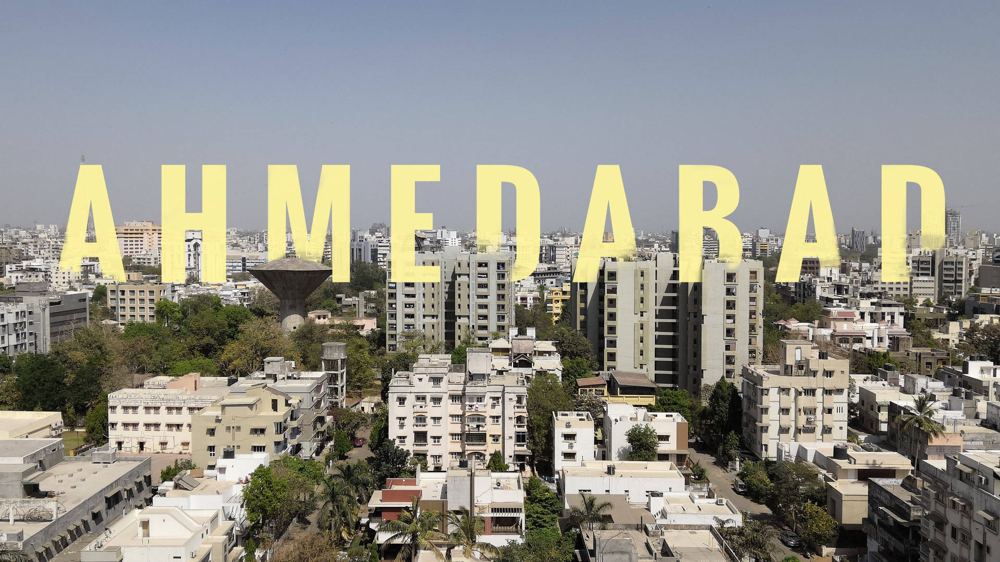

# ✂️ City Scissor – Haute Coiffure & Luxury Unisex Salon

A cinematic, immersive web experience built for **City Scissor Unisex Salon**, located on the Main Road (Opp. BRTS Bus Stop), Ambawadi, Ahmedabad.



---

## ✨ Highlights & Features

- **3D "Cut & Comb" Pre-Hero Sequence:** Interactive Three.js WebGL entrance featuring high-carbon Japanese shears, comb, razor, and floating gold dust particles with realistic studio reflections.
- **Cinematic Door Slicing:** Smooth splitting curtain reveal slicing open the Ahmedabad skyline cleanly into the atelier.
- **Kinetic Luxury Typography:** Hand-crafted Cinzel & Cormorant Garamond typography with gold-leaf metallic gradients.
- **Anime.js Scroll-Triggered Atelier Grid:** Equal-height service cards with smooth scroll-triggered stagger animations and dynamic category filtering.
- **Interactive Before/After Lookbook:** Dual-layer touch & mouse comparison slider for haircuts, balayage, and restorative rituals.
- **Interactive Dark City Map:** Styled location map pinned directly to the salon's coordinates on the Main Road in Ambawadi.
- **Bespoke Booking Concierge Modal:** 5-step VIP appointment booking system with date/time selection, stylist preference, celebratory confetti, and `.ics` calendar invite export.
- **Spatial Audio Experience:** Authentic scissor snips and tactile click sound effects with full mute/unmute control.

---

## 🛠️ Technology Stack

- **Framework:** [React 18](https://react.dev/) + [Vite 5](https://vitejs.dev/)
- **Styling:** [Tailwind CSS](https://tailwindcss.com/)
- **3D Graphics:** [Three.js](https://threejs.org/)
- **Animation Engines:** [GSAP (ScrollTrigger)](https://gsap.com/) & [Anime.js](https://animejs.com/)
- **Icons:** [Lucide React](https://lucide.dev/)
- **Celebration Effects:** [Canvas Confetti](https://www.npmjs.com/package/canvas-confetti)

---

## 🚀 Getting Started

### Prerequisites

- Node.js (v18 or higher recommended)
- npm or yarn

### Installation

```bash
# Clone the repository
git clone https://github.com/AmanPatel1521/city-scissor.git

# Navigate into the project directory
cd city-scissor

# Install dependencies
npm install

# Start the local development server
npm run dev
```

Visit `http://localhost:5173` to explore the experience locally.

### Production Build

```bash
npm run build
```

Build outputs are optimized and code-split into vendor chunks in the `dist/` directory.

---

## 📍 Location

**City Scissor Unisex Salon**  
Main Road, Opposite BRTS Bus Stop,  
Ambawadi, Ahmedabad, Gujarat 380006  

---

## 📄 License

Private repository & portfolio showcase for City Scissor Unisex Salon.
